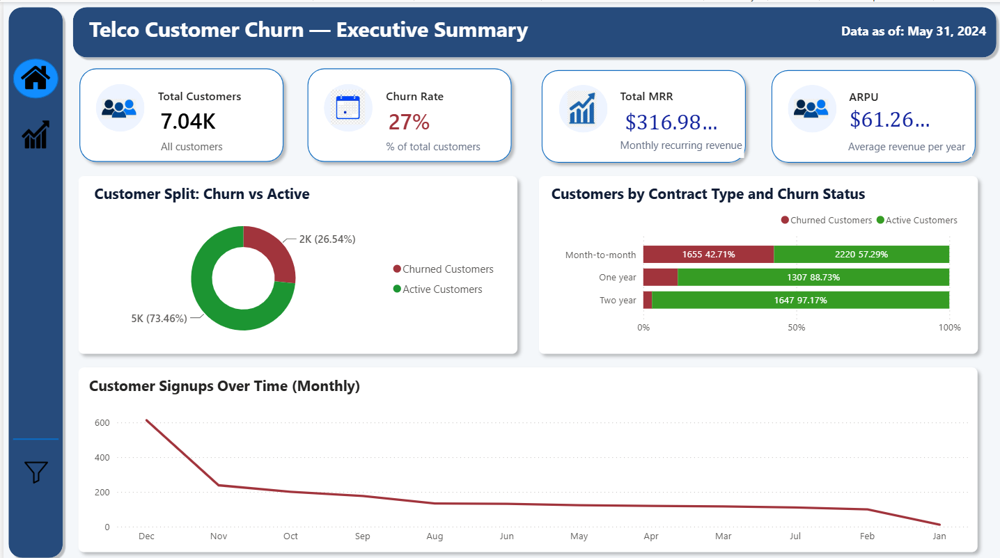
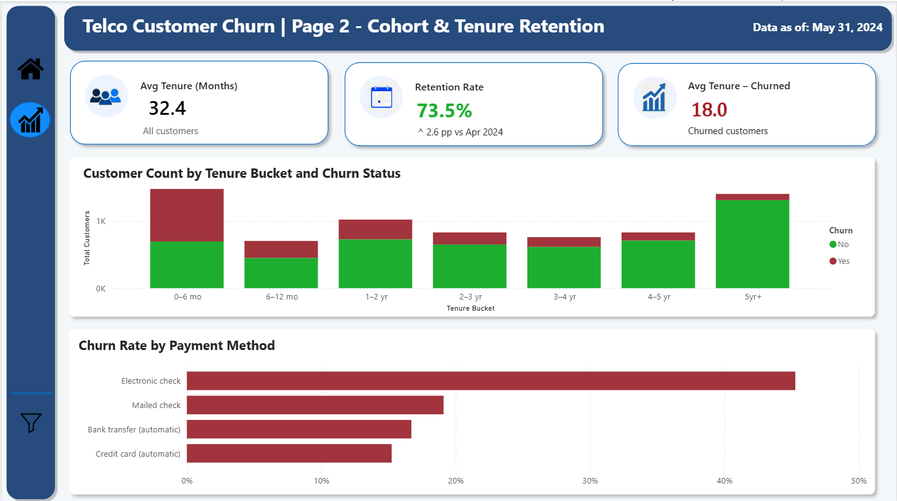

# Telco Customer Churn — SQL & Power BI Analytics

A business-focused customer churn analytics project built using **SQL, SQLite, Power BI, DAX, and dimensional data modeling**.

The project transforms a raw Telco customer dataset into a clean star-schema-style model and uses Power BI to analyze customer churn, revenue, tenure, and retention.

---

## Dashboard Preview

### Page 1 — Executive Summary



### Page 2 — Tenure & Retention



---

## Business Problem

Customer churn directly affects recurring revenue and customer lifetime value.

The objective of this project is to transform raw customer subscription data into an analytical model and build an interactive dashboard that helps answer:

- How large is the customer base?
- What is the overall churn rate?
- How much recurring revenue is generated?
- How does customer tenure relate to churn?
- Which tenure groups have higher churn?
- Which payment methods are associated with higher churn?

---

## Project Workflow

```text
Raw CSV
   ↓
SQLite
   ↓
Data Quality Checks
   ↓
Data Cleaning
   ↓
Star Schema Transformation
   ↓
Clean Analytical Tables
   ↓
Power BI Data Model
   ↓
DAX Measures
   ↓
Interactive Dashboard
```

---

# 1. Data Preparation & SQL

The raw Telco customer dataset was first loaded into SQLite as a staging table called:

`raw_customers`

### Data Quality Issue Identified

During validation, 11 customers had blank `TotalCharges` values while having zero tenure.

Since these customers had no accumulated subscription charges, the blank values were converted to:

`TotalCharges = 0.0`

---

## Signup Date Derivation

The original dataset did not contain an actual customer signup date.

To support time-based analysis, a `signup_date` was derived using:

```text
Reference Date - Tenure
```

This is a **derived field**, not an original source attribute.

The limitation is explicitly disclosed so that the resulting time-based analysis is not interpreted as historical signup data from the source system.

---

# 2. Star Schema Data Model

The original flat dataset was transformed into a star-schema-style structure.

### Fact Table

`fact_subscriptions`

Contains transactional and numeric subscription information such as:

* customer key
* contract key
* services key
* date key
* tenure
* MonthlyCharges
* TotalCharges
* Churn

### Dimension Tables

```text
dim_customer
dim_contract
dim_services
dim_date
```

Dimensions contain descriptive attributes used for filtering, grouping, and slicing the subscription data.

### Model Concept

```text
                   dim_customer
                        │
                        │
dim_contract ─── fact_subscriptions ─── dim_services
                        │
                        │
                     dim_date
```

The principle is:

> **Fact = what happened**
> **Dimension = how we describe/group what happened**

This structure reduces repeated descriptive data and provides a cleaner analytical model for Power BI.

---

# 3. Data Integrity Validation

After splitting the original flat dataset into fact and dimension tables, row counts and relationships were validated.

The checks were performed to ensure:

* No customer records were unintentionally lost
* No duplicate records were introduced
* Fact-table records remained consistent with the original dataset
* Dimension keys correctly mapped back to the fact table

---

# 4. Power BI Dashboard

The final Power BI dashboard contains two analytical pages.

## Page 1 — Executive Summary

### KPIs

* Total Customers
* Churn Rate
* Total MRR
* ARPU

### Visuals

* Customer Distribution by Churn Status
* Customer Count by Contract Type and Churn Status
* Customer Signups Over Time

### Purpose

Provides a high-level view of the customer base, churn, recurring revenue, and customer acquisition trend.

---

## Page 2 — Tenure & Retention

### KPIs

* Average Tenure
* Retention Rate
* Average Tenure — Churned
* Senior Citizen %

### Visuals

* Customer Count by Tenure Bucket and Churn Status
* Churn Rate by Tenure Bucket
* Churn Rate by Payment Method

### Purpose

Explores how customer lifecycle stage and payment method relate to retention and churn.

---

# 5. DAX & Power BI Calculations

SQL was primarily used for **data preparation and transformation**.

DAX was then used inside Power BI for calculations that need to respond dynamically to filters and visual context.

Examples include:

* Churn Rate
* Retention Rate
* ARPU
* MRR
* Customer counts
* Tenure buckets
* Churn-related KPIs

### SQL vs DAX

```text
SQL
↓
Prepare / Clean / Transform data

DAX
↓
Calculate dynamically inside Power BI
```

SQL prepares the analytical foundation, while DAX calculates metrics based on the current filter context.

---

# 6. Measure vs Calculated Column

### Measures

Measures are calculated dynamically based on the current filter context.

Examples:

```text
Churn Rate
Retention Rate
ARPU
Total MRR
```

They change when users interact with slicers, filters, or visuals.

### Calculated Columns

Calculated columns are evaluated row-by-row and stored as part of the model.

Examples:

```text
Tenure Bucket
Churn Risk Flag
```

### Rule of Thumb

```text
Dynamic aggregations / ratios → Measure

Row-level labels / categories → Calculated Column
```

---

# 7. Key Analytical Findings

The dashboard highlights several patterns in the dataset:

* Overall customer churn is approximately **26.5%**.
* Customers with shorter tenure show substantially higher churn.
* The earliest tenure bucket has the highest churn rate.
* Churn decreases as customer tenure increases.
* Electronic-check customers show the highest churn rate among the payment methods analyzed.
* Month-to-month contracts have a substantially higher churn rate than longer-term contracts.

These findings are descriptive observations from the supplied dataset and are not intended to establish causal relationships.

---

# 8. Technology Stack

| Technology      | Purpose                                      |
| --------------- | -------------------------------------------- |
| **SQL**         | Data cleaning, validation and transformation |
| **SQLite**      | Local staging and data preparation           |
| **Power BI**    | Dashboard and visualization                  |
| **DAX**         | Dynamic analytical calculations              |
| **CSV**         | Source and transformed data                  |
| **Star Schema** | Analytical data modeling                     |

---

# 9. Repository Structure

```text
telco-customer-churn-powerbi/
│
├── data/
│   ├── raw/
│   │   └── WA_Fn-UseC_-Telco-Customer-Churn.csv
│   │
│   └── clean/
│       ├── dim_contract.csv
│       ├── dim_customer.csv
│       ├── dim_services.csv
│       └── fact_subscriptions.csv
│
├── screenshots/
│   ├── page1-executive-summary.png
│   └── page2-tenure-retention.png
│
├── README.md
├── Telco_Customer_Churn.pbix
└── .gitignore
```

---

# 10. Limitations & Assumptions

### Derived Signup Date

The source dataset does not contain an actual signup date.

The signup date used for time-based analysis was derived from customer tenure and a reference date.

Therefore, signup-related trends should be interpreted as derived analytical estimates rather than historical CRM signup records.

### Dataset Scope

The analysis reflects the provided Telco customer dataset and should not be interpreted as representative of a real telecom company's current customer population.

### Correlation vs Causation

The dashboard identifies patterns and associations in the data. It does not establish that a particular contract, payment method, or tenure category directly causes churn.

---

# 11. Future Improvements

Potential extensions include:

* Predictive churn model using machine learning
* Customer lifetime value prediction
* Automated data refresh pipeline
* More granular customer segmentation
* Retention campaign simulation
* Model monitoring and prediction evaluation
* Integration with a production database instead of local CSV/SQLite files

---

## Author

**Ishika Singh**

Built as a portfolio project to demonstrate practical skills in:

**SQL → Data Modeling → Power BI → DAX → Business Analytics**
